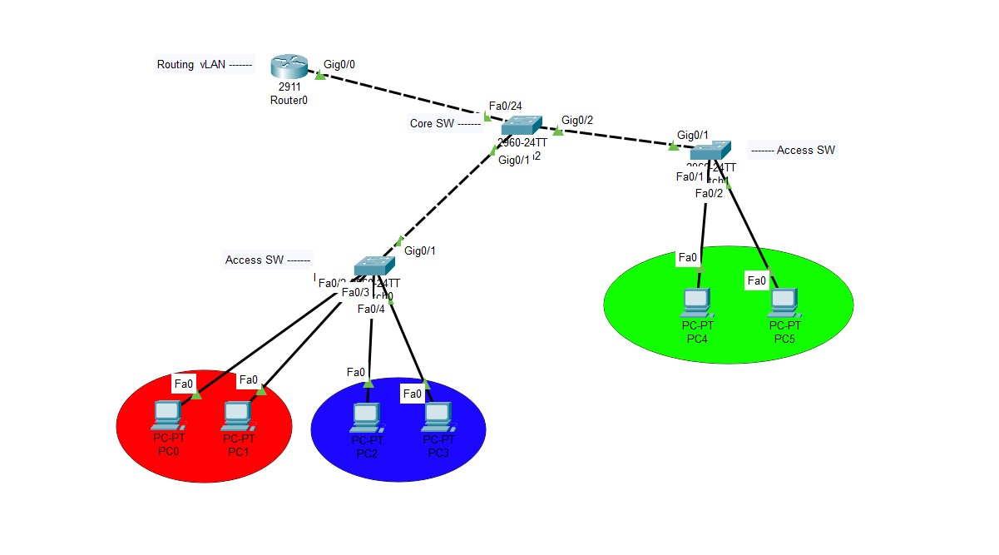

# 🔌 CCNA VLAN & Inter-VLAN Routing Lab (Cisco Packet Tracer)

Welcome to the CCNA Lab project where we design and configure a basic but solid VLAN and Inter-VLAN routing topology using Cisco Packet Tracer.

---

## 📐 Network Topology Overview

- 🔸 **3 VLANs**
  - VLAN 10 → HR
  - VLAN 20 → IT
  - VLAN 30 → Sales
- 🔸 **Devices**
  - 1 Router (Router-on-a-Stick)
  - 1 Core Switch (Trunk to Router & Access Switches)
  - 2 Access Switches
  - 6 PCs (2 per VLAN)

---

## 🖥️ IP Addressing Table

| VLAN | Subnet           | Gateway        | Devices         |
|------|------------------|----------------|-----------------|
| 10   | 192.168.10.0/24  | 192.168.10.1   | PC1, PC2        |
| 20   | 192.168.20.0/24  | 192.168.20.1   | PC3, PC4        |
| 30   | 192.168.30.0/24  | 192.168.30.1   | PC5, PC6        |

---

## ⚙️ Configuration Files

Available under the `configs/` folder:
- `router.txt`: Sub-interface configuration
- `core_switch.txt`: Trunk ports and VLANs
- `access_switch1.txt`: Access ports for VLAN 10 & 20
- `access_switch2.txt`: Access ports for VLAN 30

---

## 📄 Documentation

Find in the `documentation/` folder:
- `vlan_config.md`: Explanation of VLAN creation and port assignment
- `inter_vlan_routing.md`: How Router-on-a-Stick works + commands

---

## 📂 Packet Tracer File

The complete `.pkt` file is included:  
`CCNA_VLAN_Project.pkt`

You can open it with Cisco Packet Tracer and simulate the network.

---

## ✅ Learning Outcomes

- VLAN creation and port assignment
- Trunk configuration
- Router-on-a-Stick (Inter-VLAN Routing)
- Basic IP addressing and connectivity testing

---

## 🖼️ Photos

  

---
## 🔥 Motivation

> “Start where you are. Use what you have. Do what you can.” — Arthur Ashe

---

## 🧠 Author

Made with ❤️ by **HeidarAli**  
For learning, practice, and leveling up in Cisco networking 💪

